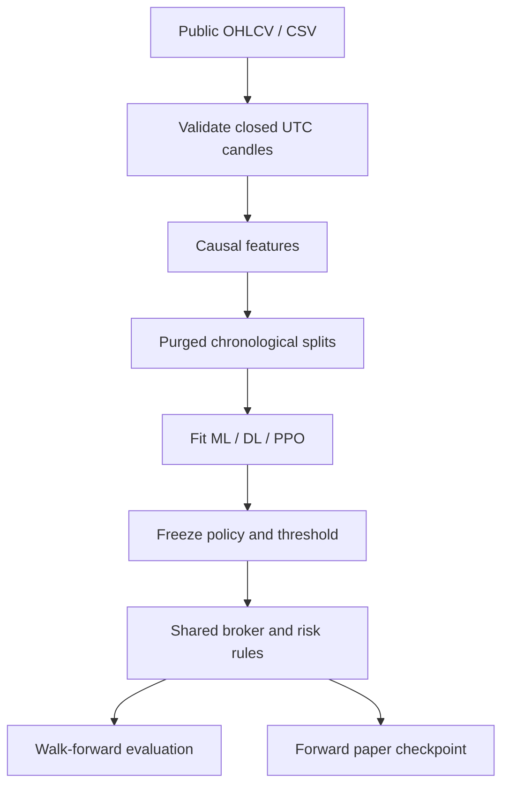

# Architecture and execution contract

| Module | Responsibility |
|---|---|
| `data.py` | UTC open timestamps, closed-candle/range/gap validation, public CCXT download, snapshots |
| `features.py` | Trailing indicators; current cloud is shifted +26; future labels are separate |
| `models.py`, `torch_models.py` | Train-only scaler, historical windows, binary forecasts, early stopping |
| `rl.py` | PPO/Gymnasium; fixed historical window plus portfolio and risk state |
| `engine.py` | Long/flat spot accounting, execution costs, stops, circuit breakers |
| `splits.py`, `experiment.py` | Purged walk-forward orchestration, baseline comparison, provenance |
| `metrics.py` | Equity-based metrics, paired dependence-aware descriptive intervals |
| `paper.py` | Persisted intent, simulated account, history/model binding, duplicate protection |
| `cli.py` | Fetch, research, demo and paper commands |

## Timing

Each input index is a candle **open** time. Candle t becomes usable at t + interval. Features and the trading intention are computed from that complete candle and prior history. The earliest simulated signal fill is the following candle's open, with adverse slippage and a fee. High/low data for that following candle are used only to settle resting stop/take conditions, not to generate the earlier intention.

Stop-loss and take-profit levels are fixed at entry from the previously known ATR. An opening gap beyond a stop fills at the worse open. If both stop and take are touched within one candle, stop is assumed first. Risk checks use open/close marked equity; intrabar peaks, order-book queueing, liquidity limits, partial fills and exchange precision are not simulated. Thresholds are triggers, not guaranteed loss caps.

PPO receives a flattened historical feature window and current exposure, equity change, drawdown, daily equity change, halt flags and stop/take distances. Its reward is the logarithm of the net equity ratio, including terminal liquidation fees. No borrowing or shorting is modeled.

## Credentials and tokens

Public adapters instantiate CCXT without authentication and only request market/candle data. The paper broker updates a local JSON account. There is no password login, refresh token, withdrawal, private balance access or live order method in this version. GitHub's connector credentials are separate from bot configuration and are never stored in the repository. An authenticated production adapter would be a separately reviewed implementation, not a configuration switch that turns this simulator into a live broker.

## Checkpoint consistency

Paper state is atomically replaced under a single-writer lock. It records the model artifact hash, market/timeframe, last processed candle, pending intent and ATR, fills, equity and risk flags. The training-history prefix must exactly match the artifact's checksum. Changed historical data, a model replacement, stale candles and missing settlement candles fail explicitly. This strict policy favors auditable replay; data corrections require a new controlled experiment/account.
